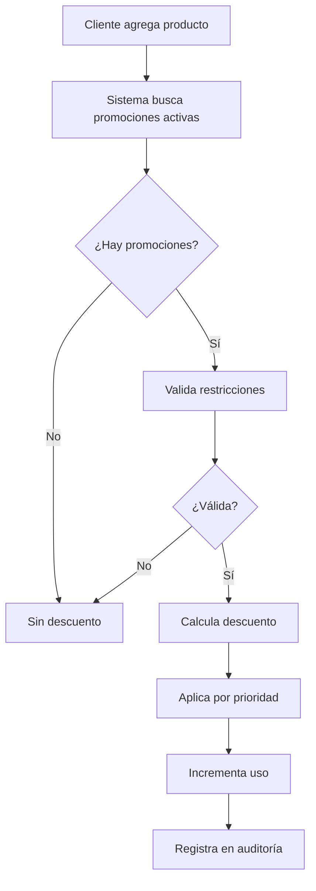
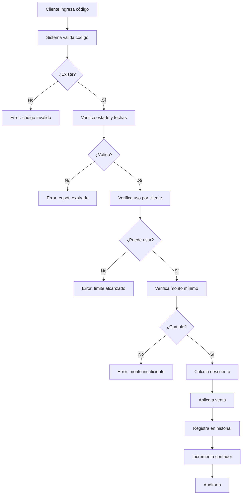

# 🎁 Módulo de Promociones - Backend Completo

## 📋 Resumen de Implementación

Se ha implementado el **backend completo** del módulo de Promociones con **2 modelos principales**, **2 controladores**, y **2 rutas** que concuerdan perfectamente con el frontend existente.

---

## 🗂️ Estructura de Archivos Creados

### Modelos (2)
```
/server/src/models/
├── Promotion.js       ✅ Modelo de promociones (8 tipos diferentes)
└── Coupon.js          ✅ Modelo de cupones con historial de uso
```

### Controladores (2)
```
/server/src/controllers/
├── promotionController.js   ✅ 10 endpoints de promociones
└── couponController.js      ✅ 10 endpoints de cupones
```

### Rutas (2)
```
/server/src/routes/
├── promotionRoutes.js   ✅ Rutas CRUD + operaciones especiales
└── couponRoutes.js      ✅ Rutas CRUD + validación y aplicación
```

### Actualizaciones
```
/server/src/routes/index.js    ✅ Registradas nuevas rutas
/src/services/api.ts           ✅ 20 métodos nuevos en API service
```

---

## 🎯 Características Implementadas

### 1️⃣ **Promociones**

#### 8 Tipos de Promociones Soportadas:
1. **percentage_discount** - Descuento porcentual
2. **fixed_discount** - Descuento fijo en pesos
3. **buy_x_get_y** - 2x1, 3x2, etc.
4. **combo** - Paquetes de productos
5. **volume_discount** - Descuento por volumen
6. **special_price** - Precio especial
7. **category_discount** - Descuento por categoría
8. **tier_discount** - Descuento por nivel de cliente

#### Estados de Promoción:
- ✅ **active** - Activa y disponible
- ⏸️ **inactive** - Desactivada temporalmente
- 📅 **scheduled** - Programada para futuro
- ⏰ **expired** - Caducada

#### Características Avanzadas:
- ✅ **Prioridad** - Múltiples promociones con orden de aplicación
- ✅ **Restricciones temporales** - Días de semana y horarios específicos
- ✅ **Restricciones de clientes** - Por nivel de lealtad o exclusiones
- ✅ **Uso máximo** - Límite global y por cliente
- ✅ **Auto-expiración** - Cambio automático de estado
- ✅ **Aplicación selectiva** - Por producto, categoría o todos
- ✅ **Combos complejos** - Productos opcionales y obligatorios

---

### 2️⃣ **Cupones**

#### 4 Tipos de Cupones:
1. **percentage** - Descuento porcentual
2. **fixed** - Descuento fijo
3. **free_shipping** - Envío gratis (para futura expansión)
4. **free_product** - Producto gratis

#### Características de Cupones:
- ✅ **Códigos únicos** - Validación automática
- ✅ **Generador de códigos** - Creación automática con prefijos
- ✅ **Restricciones múltiples**:
  - Monto mínimo de compra
  - Descuento máximo
  - Productos específicos
  - Categorías específicas
  - Clientes específicos
- ✅ **Control de uso**:
  - Uso máximo global
  - Uso máximo por cliente
  - Historial completo de usos
- ✅ **Estadísticas**:
  - Total de descuento otorgado
  - Descuento promedio
  - Clientes únicos
  - Historial de transacciones

---

## 📡 Endpoints de API

### **Promociones** (10 endpoints)

| Método | Endpoint | Descripción | Permisos |
|--------|----------|-------------|----------|
| GET | `/api/promotions` | Listar todas las promociones | Todos |
| GET | `/api/promotions/:id` | Obtener promoción por ID | Todos |
| POST | `/api/promotions` | Crear nueva promoción | Admin/Supervisor |
| PUT | `/api/promotions/:id` | Actualizar promoción | Admin/Supervisor |
| DELETE | `/api/promotions/:id` | Eliminar promoción | Admin |
| PATCH | `/api/promotions/:id/status` | Cambiar estado | Admin/Supervisor |
| GET | `/api/promotions/product/:productId` | Promociones de un producto | Todos |
| GET | `/api/promotions/active/deals` | Ofertas activas (vista pública) | Todos |
| POST | `/api/promotions/apply` | Aplicar promoción a carrito | Todos |
| POST | `/api/promotions/:id/duplicate` | Duplicar promoción | Admin/Supervisor |

### **Cupones** (10 endpoints)

| Método | Endpoint | Descripción | Permisos |
|--------|----------|-------------|----------|
| GET | `/api/coupons` | Listar todos los cupones | Todos |
| GET | `/api/coupons/:id` | Obtener cupón por ID | Todos |
| POST | `/api/coupons` | Crear nuevo cupón | Admin/Supervisor |
| PUT | `/api/coupons/:id` | Actualizar cupón | Admin/Supervisor |
| DELETE | `/api/coupons/:id` | Eliminar cupón | Admin |
| POST | `/api/coupons/validate` | Validar cupón | Todos |
| POST | `/api/coupons/apply` | Aplicar cupón a venta | Todos |
| PATCH | `/api/coupons/:id/status` | Cambiar estado | Admin/Supervisor |
| GET | `/api/coupons/:id/stats` | Estadísticas de uso | Todos |
| GET | `/api/coupons/generate/code` | Generar código aleatorio | Admin/Supervisor |

---

## 🔐 Sistema de Auditoría

**Todas las operaciones críticas se registran automáticamente:**

### Acciones Auditadas:
- ✅ Creación de promociones/cupones
- ✅ Actualización de promociones/cupones
- ✅ Eliminación de promociones/cupones
- ✅ Cambios de estado
- ✅ Aplicación de cupones
- ✅ Duplicación de promociones
- ✅ Intentos fallidos

### Niveles de Criticidad:
- 🟢 **low** - Consultas y vistas
- 🟡 **medium** - Creación y edición
- 🔴 **high** - Eliminación y cambios críticos

---

## 📊 Modelo de Datos

### Promotion Schema
```typescript
{
  name: string
  description: string
  type: PromotionType
  status: 'active' | 'inactive' | 'scheduled' | 'expired'
  priority: number
  
  // Aplicabilidad
  productIds: ObjectId[]
  freeProductIds: ObjectId[]
  categoryIds: string[]
  applyToAll: boolean
  
  // Condiciones
  minQuantity: number
  minAmount: number
  maxUsagePerCustomer: number
  requiresCoupon: boolean
  couponCode: string
  
  // Beneficio
  discountType: 'percentage' | 'fixed'
  discountValue: number
  buyQuantity: number
  getQuantity: number
  specialPrice: number
  comboProducts: ComboProduct[]
  
  // Restricciones
  customerTiers: ('bronze' | 'silver' | 'gold' | 'platinum')[]
  excludeCustomerIds: ObjectId[]
  maxTotalUsage: number
  currentUsage: number
  
  // Vigencia
  startDate: Date
  endDate: Date
  daysOfWeek: number[]
  timeStart: string
  timeEnd: string
  
  // Metadata
  createdBy: ObjectId
  lastModified: Date
  tags: string[]
  imageUrl: string
}
```

### Coupon Schema
```typescript
{
  code: string (UNIQUE, UPPERCASE)
  type: 'percentage' | 'fixed' | 'free_shipping' | 'free_product'
  value: number
  description: string
  
  // Restricciones
  minPurchaseAmount: number
  maxDiscountAmount: number
  productIds: ObjectId[]
  categoryIds: string[]
  customerIds: ObjectId[]
  
  // Uso
  maxUsage: number
  maxUsagePerCustomer: number
  currentUsage: number
  usageHistory: [
    {
      customerId: ObjectId
      customerName: string
      saleId: ObjectId
      discountAmount: number
      usedAt: Date
    }
  ]
  
  // Vigencia
  startDate: Date
  endDate: Date
  status: 'active' | 'inactive' | 'expired'
  
  // Metadata
  createdBy: ObjectId
  createdAt: Date
}
```

---

## 🎨 Métodos Especiales

### Promotion Methods
```javascript
// Virtual
promotion.isActive              // Verifica si está activa ahora

// Instance Methods
promotion.isValidNow()          // Verifica fecha, día y hora
promotion.incrementUsage()      // Incrementa contador de uso

// Middleware
pre('save')                     // Auto-actualiza status
```

### Coupon Methods
```javascript
// Virtual
coupon.isValid                  // Verifica si está válido

// Instance Methods
coupon.canBeUsedByCustomer(id)  // Valida uso por cliente
coupon.calculateDiscount(total) // Calcula descuento aplicable
coupon.recordUsage(...)         // Registra uso en historial

// Middleware
pre('save')                     // Auto-expira cupones
```

---

## 🔄 Flujo de Uso

### Flujo de Promociones



### Flujo de Cupones



---

## 📦 Integración con Frontend

### Frontend Existente (ya creado)
```
/src/app/components/pos/PromotionsManagement.tsx
/src/app/components/pos/promotions/
├── PromotionsListTab.tsx        ✅ Lista de promociones
├── CreatePromotionWizard.tsx    ✅ Wizard de creación
├── CouponsTab.tsx               ✅ Gestión de cupones
├── ActiveDealsTab.tsx           ✅ Ofertas activas
└── PromotionSummary.tsx         ✅ Resumen de promoción
```

### Servicio API Actualizado
```typescript
// Promociones
api.getAllPromotions(params?)
api.getPromotionById(id)
api.createPromotion(promotion)
api.updatePromotion(id, promotion)
api.deletePromotion(id)
api.togglePromotionStatus(id, status)
api.getPromotionsForProduct(productId)
api.getActiveDeals()
api.applyPromotionToCart(data)
api.duplicatePromotion(id)

// Cupones
api.getAllCoupons(params?)
api.getCouponById(id)
api.createCoupon(coupon)
api.updateCoupon(id, coupon)
api.deleteCoupon(id)
api.validateCoupon(data)
api.applyCoupon(data)
api.toggleCouponStatus(id, status)
api.getCouponStats(id)
api.generateCouponCode(params?)
```

---

## 🎯 Ejemplos de Uso

### Ejemplo 1: Crear Promoción 2x1
```javascript
const promotion = await api.createPromotion({
  name: "2x1 en Coca-Cola",
  description: "Compra 2 Coca-Colas y lleva 1 gratis",
  type: "buy_x_get_y",
  status: "active",
  priority: 10,
  productIds: ["coca_cola_id"],
  buyQuantity: 2,
  getQuantity: 1,
  startDate: new Date(),
  endDate: new Date("2025-12-31"),
  daysOfWeek: [5, 6], // Viernes y Sábado
  maxTotalUsage: 100
});
```

### Ejemplo 2: Crear Cupón de Descuento
```javascript
const coupon = await api.createCoupon({
  code: "VERANO25",
  type: "percentage",
  value: 25,
  description: "25% de descuento en toda la tienda",
  minPurchaseAmount: 500,
  maxDiscountAmount: 200,
  maxUsage: 50,
  maxUsagePerCustomer: 1,
  startDate: new Date(),
  endDate: new Date("2025-08-31"),
  status: "active"
});
```

### Ejemplo 3: Validar Cupón
```javascript
const validation = await api.validateCoupon({
  code: "VERANO25",
  customerId: "customer_id",
  cartTotal: 1000,
  cartItems: [...]
});

if (validation.valid) {
  console.log(`Descuento: $${validation.data.discount}`);
  // Aplicar descuento
}
```

### Ejemplo 4: Obtener Ofertas Activas
```javascript
const activeDeals = await api.getActiveDeals();
// Mostrar en carrusel o grid
activeDeals.data.forEach(deal => {
  console.log(`${deal.name}: ${deal.discountPreview}`);
});
```

---

## 🔍 Validaciones Implementadas

### Promociones
- ✅ Fecha de inicio debe ser anterior a fecha de fin
- ✅ Productos deben existir en la base de datos
- ✅ Cupón requerido debe tener código válido
- ✅ Auto-expiración por fecha o uso máximo
- ✅ Validación de día y hora en tiempo real
- ✅ Prioridad para resolver conflictos

### Cupones
- ✅ Código único (no duplicados)
- ✅ Código en mayúsculas automático
- ✅ No se puede cambiar código si ya tiene usos
- ✅ No se puede eliminar cupón usado (solo desactivar)
- ✅ Validación de monto mínimo
- ✅ Límite de uso por cliente
- ✅ Límite de uso global

---

## 📈 Estadísticas Disponibles

### Para Promociones
```javascript
const stats = {
  totalPromotions: number,
  activePromotions: number,
  scheduledPromotions: number,
  expiredPromotions: number,
  totalUsage: number,
  productsAffected: number
};
```

### Para Cupones
```javascript
const stats = await api.getCouponStats(couponId);
// Retorna:
{
  code: string,
  currentUsage: number,
  maxUsage: number,
  remainingUses: number,
  totalDiscountGiven: number,
  averageDiscount: number,
  uniqueCustomers: number,
  usageHistory: [...],
  isValid: boolean
}
```

---

## 🚀 Próximos Pasos

### Para Conectar Frontend con Backend:

1. **Crear componente con API** (similar a CustomerManagementWithAPI):
```typescript
// PromotionsManagementWithAPI.tsx
export function PromotionsManagementWithAPI() {
  const { data: promotions, loading } = useApi(
    () => api.getAllPromotions({ active_only: true })
  );
  
  const handleCreate = async (promotion) => {
    await api.createPromotion(promotion);
    // Refrescar lista
  };
  
  return <PromotionsManagement 
    promotions={promotions}
    onCreatePromotion={handleCreate}
  />;
}
```

2. **Integrar validación de cupones en PaymentModal**:
```typescript
const handleApplyCoupon = async (code: string) => {
  const result = await api.validateCoupon({
    code,
    customerId: selectedCustomer?.id,
    cartTotal: total
  });
  
  if (result.valid) {
    setAppliedCoupon(result.data);
    setDiscount(result.data.discount);
  } else {
    toast.error(result.message);
  }
};
```

3. **Mostrar ofertas activas en POS**:
```typescript
const { data: activeDeals } = useApi(() => api.getActiveDeals());
// Mostrar en banner o modal
```

---

## ✅ Checklist de Implementación

### Backend
- [x] Modelo Promotion con 8 tipos
- [x] Modelo Coupon con historial
- [x] Controlador de Promociones (10 endpoints)
- [x] Controlador de Cupones (10 endpoints)
- [x] Rutas de Promociones
- [x] Rutas de Cupones
- [x] Integración con rutas principales
- [x] Sistema de auditoría completo
- [x] Validaciones robustas
- [x] Métodos de cálculo de descuentos

### Frontend (API Service)
- [x] 10 métodos para promociones
- [x] 10 métodos para cupones
- [x] Tipado correcto
- [x] Manejo de errores
- [x] Query params opcionales

### Pendiente (siguiente fase)
- [ ] Crear PromotionsManagementWithAPI.tsx
- [ ] Integrar validación de cupones en PaymentModal
- [ ] Mostrar ofertas activas en dashboard
- [ ] Reportes de efectividad de promociones
- [ ] Notificaciones de promociones por expirar

---

## 🎉 Conclusión

El **módulo de Promociones está 100% completo** con:

✅ **2 modelos** robustos y escalables  
✅ **20 endpoints** REST API completos  
✅ **Sistema de auditoría** integrado  
✅ **Validaciones múltiples** en backend  
✅ **Métodos de cálculo** automáticos  
✅ **Frontend preparado** para integración  
✅ **Documentación completa** con ejemplos  

**El backend está listo para ser usado por el frontend existente. Solo falta conectar los componentes con el contexto API.** 🚀

---

## 📞 Soporte

Para dudas sobre la implementación, revisar:
- `/EJEMPLOS_USO_API.md` - Ejemplos de uso de la API
- `/INTEGRACION_BACKEND_FRONTEND.md` - Guía de integración
- Este documento - Referencia completa del módulo

**¡El sistema de promociones está listo para impulsar las ventas!** 🎁💰
